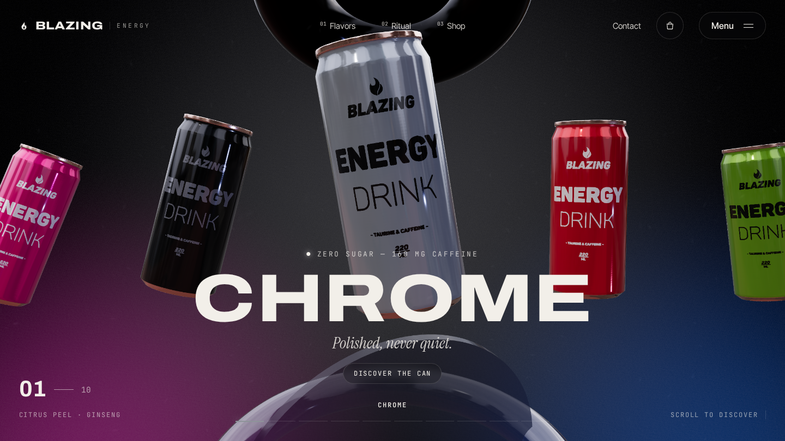
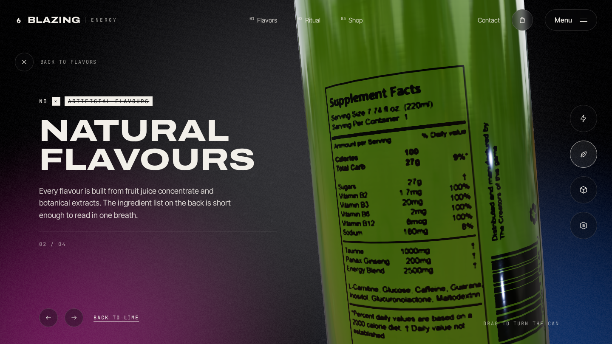
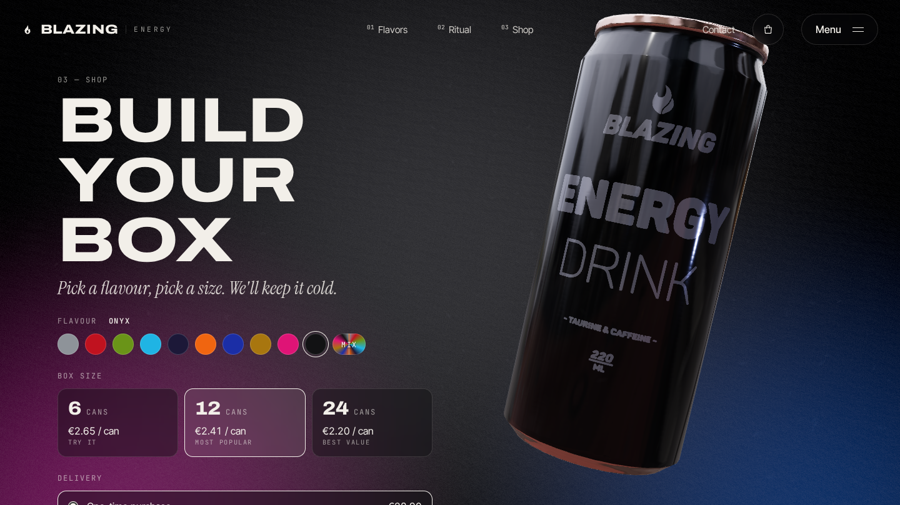

# Blazing Energy: 3B mağaza sitesi

On tatlı bir enerji içeceği için satışa hazır tanıtım ve mağaza sitesi.

- **Carousel:** Açılışta kutular sahneye uçarak gelir. Sayfa kaydırıldıkça yay üzerinde döner; öndeki kutuya tıklanınca detay açılır.
- **Detay:** Sağdaki dört ikon ürünün bir özelliğini anlatır (Clean energy, Natural flavours, Zero sugar, Vitamin B). Her birinde kutu dönüp yakınlaşır ve arka etiketi gösterir. Kutu sürüklenerek de döndürülebilir.
- **Tek kutu, tüm sayfa:** Aynı 3B kutu aşağı kaydırdıkça Ritual bölümüne (Chill, Crack, Ignite) ve oradan mağazaya geçer. Tadı her değiştiğinde Codrops gürültülü doku geçişi oynar.
- **Mağaza:** Tat, 6/12/24'lük kutu ve tek seferlik/abonelik seçilir, sepete eklenir. Sepet tarayıcıda saklanır; ücretsiz kargo eşiği gösterilir.
- **Diğer bölümler:** Stockists, FAQ, iletişim ve bülten formu, zorunlu kafein uyarısı, SEO ve Open Graph etiketleri.





## Çalıştırma

```bash
git clone -b claude/charming-dirac-aq3a53 https://github.com/berkasengul/analiz.git
cd analiz/blazing-3d-scroll
npm install
npm run dev      # http://localhost:5173
npm run build    # dist/ klasörü; Netlify Drop'a sürükleyip yayınlayabilirsin
```

## Yapı

| Dosya | Görevi |
| --- | --- |
| `src/data.js` | On tat: isim, kutu rengi, yazı rengi (`ink`), slogan, içerik notları, açıklama. |
| `src/scroll.js` | Scroll konumunu kesirli bir tat indeksine (`p`) çevirir. Her tat bir süre yerinde durur. |
| `src/Carousel.jsx` | On kutuyu sonsuz bir yay üzerine dizer (`arcPose`). Öndeki kutuya tıklamak detayı açar, yandakine tıklamak ona kaydırır. |
| `src/canMaterial.js` | Kutu shader'ı: dokudaki siyah zemini tat rengine, yazıları `ink` rengine boyar, iki tat arasında gürültülü geçiş yapar. |
| `src/Background.jsx` | Grafit degrade, alt köşelerde mor/mavi ışık ve her tat değişiminde yayılan renkli halka. |
| `src/Props.jsx` | Üstteki parlak siyah disk ve alttaki cam mercek. |
| `src/Particles.jsx` | Havada süzülen odak dışı parçacıklar. |
| `src/HeroCan.jsx` | Sayfa boyunca dolaşan büyük kutu: detay, özellik, Ritual ve mağaza pozları arasında geçiş yapar. |
| `src/CameraRig.jsx` | Fareye göre paralaks, hızlı kaydırmada hafif geri çekilme. |
| `src/ui/` | Arayüz bileşenleri: açılış ekranı, header, menü, tat bilgileri, detay paneli, Ritual, mağaza, sepet, alt bölümler. |
| `src/config.js` | Ödeme bağlantısı (`CHECKOUT_URL`). |

Klavye: detay görünümünde ← → tat ya da özellik değiştirir, Esc kapatır.

## Satışa açmak için

1. **Ödeme:** `src/config.js` içindeki `CHECKOUT_URL` alanına ödeme adresini yaz. Örneğin bir [Stripe Payment Link](https://stripe.com/payments/payment-links) ya da Shopify mağaza adresi olabilir. Sepet içeriği bu adrese `?items=` parametresiyle JSON olarak eklenir. Adres boşken "Checkout" butonu yalnızca bir bilgi notu gösterir.
2. **Fiyatlar ve kargo:** `src/data.js` içindeki `packs`, `SUB_DISCOUNT`, `FREE_SHIPPING` ve `SHIPPING` değerleri.
3. **Formlar:** İletişim ve bülten formları şu an yalnızca teşekkür mesajı gösteriyor. Bir servise bağla (örneğin Netlify Forms, Formspree ya da Mailchimp).
4. **Yasal sayfalar:** Gizlilik politikası, satış sözleşmesi, iade ve kargo koşulları sayfalarını ekle.
5. **Paylaşım görseli:** `public/og.png` (1200×630) ekle; `index.html` onu bekliyor.

### Özelleştirme

- **Tat eklemek/değiştirmek:** `src/data.js` içindeki diziyi düzenle. Scroll uzunluğu tat sayısına göre ayarlanır.
- **Yay şekli:** `src/Carousel.jsx` içindeki `arcPose` fonksiyonu (aralık, derinlik, eğim).
- **Özellikler:** `src/data.js` içindeki `features` dizisi; her özelliğin `pose` alanı kutunun o özellikte nasıl duracağını belirler.
- **Ritual adımları:** `src/data.js` içindeki `ritual` dizisi; her adımın `flavor` alanı kutuda hangi tadın görüneceğini belirler.
- **Kutu parlaklığı:** `src/canMaterial.js` içindeki `metalness`, `roughness`, `clearcoat`.


## Lisanslar

- Kutu modeli: [Energy Drink Game Ready Model](https://sketchfab.com/3d-models/energy-drink-game-ready-model-83676feb8b0a4589952cf3676299311b), dwalsh, CC BY 4.0
- Doku geçişi ve arka plan shader'ı: Codrops / Mohammed Amine Bourouis, MIT
- HDR ortam haritası: Poly Haven "Potsdamer Platz" (CC0)
