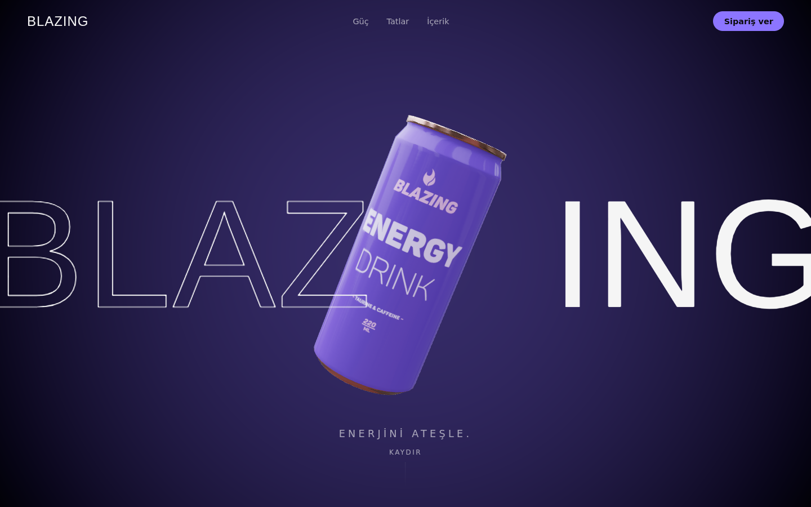
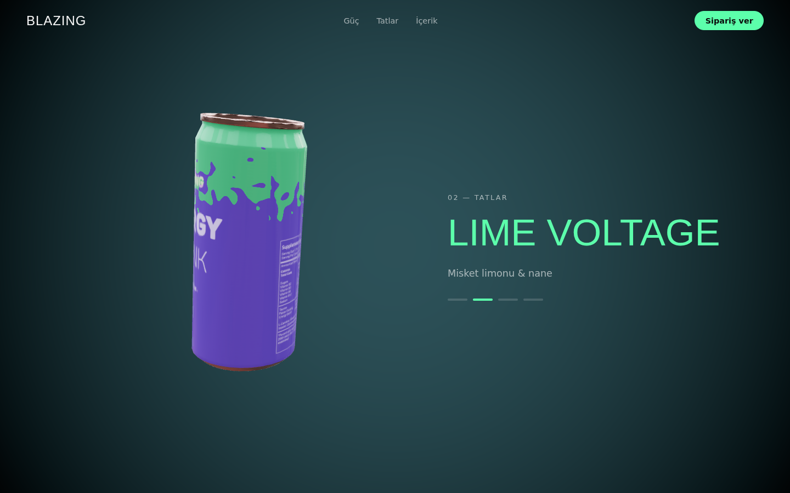
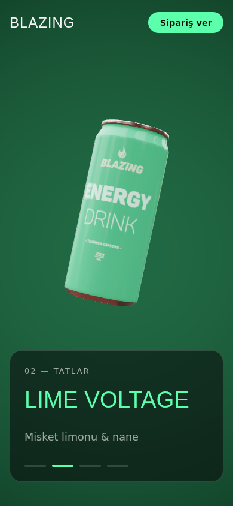

# Blazing Energy: 3B scroll tanıtım sayfası

Bir enerji içeceği kutusunun sayfa kaydırıldıkça yer değiştirdiği, döndüğü ve
tat bölümünde **gürültülü doku geçişiyle** renk değiştirdiği tek sayfalık site.

Temel olarak [mohAmineBrs/codrops-noise-transition](https://github.com/mohAmineBrs/codrops-noise-transition)
(MIT) projesindeki kutu modeli, doku geçiş shader'ı ve radyal gürültü arka planı kullanıldı.
Tıklamayla tetiklenen geçiş, scroll ile sürülecek şekilde yeniden yazıldı.




## Çalıştırma

```bash
cd blazing-3d-scroll
npm install
npm run dev      # http://localhost:5173
npm run build    # dist/ klasörüne çıktı (Netlify'a doğrudan yüklenebilir)
```

## Nasıl çalışıyor

| Dosya | Görevi |
| --- | --- |
| `src/scroll.js` | Scroll konumundan iki değer üretir: `section` (hangi bölümdeyiz, kesirli) ve `flavor` (hangi tattayız, kesirli). |
| `src/data.js` | Tatlar (isim, renk) ve kutunun her bölümdeki pozu (`poses`: konum, dönüş, ölçek). |
| `src/Model.jsx` | Her karede hedef pozu `section` değerine göre hesaplar ve kutuyu yumuşakça oraya taşır. `flavor` değeri shader'daki `u_progress`'i sürer, böylece renk geçişi scroll ile ileri geri oynatılabilir. |
| `src/Background.jsx` | Radyal gürültü arka planı. Renk tatla birlikte değişir, her tat değişiminde ortadan bir halka yayılır. |
| `src/App.jsx` | HTML bölümleri, [Lenis](https://github.com/darkroomengineering/lenis) ile yumuşak kaydırma. |

Tat bölümü `4 × 100vh` yüksekliğinde ve içeriği `position: sticky`. Kaydırdıkça kutu
yerinde kalıp sırayla dört tata geçer.

### Özelleştirme

- **Yeni bölüm:** `App.jsx`'e `data-section` özniteliğiyle bir `<section>` ekle ve `data.js` içindeki `poses` dizisine aynı sırada bir poz ekle.
- **Yeni tat:** `data.js` içindeki `flavors` dizisine renk ekle. Tat bölümünün yüksekliği otomatik olarak uzar.
- **Hız:** `Model.jsx` içindeki `MathUtils.damp(..., 3.5, ...)` değeri küçüldükçe kutu daha ağır takip eder.

Dikey ekranlarda kutu ortada kalır, metinler bulanık arka planlı kartlarda altta görünür.
`prefers-reduced-motion` açıksa yumuşak kaydırma ve metin animasyonları kapanır.



## Lisanslar

- Kutu modeli: [Energy Drink Game Ready Model](https://sketchfab.com/3d-models/energy-drink-game-ready-model-83676feb8b0a4589952cf3676299311b), dwalsh, CC BY 4.0
- Doku geçişi ve arka plan shader'ı: Codrops / Mohammed Amine Bourouis, MIT
- HDR ortam haritası: Poly Haven "Potsdamer Platz" (CC0)
