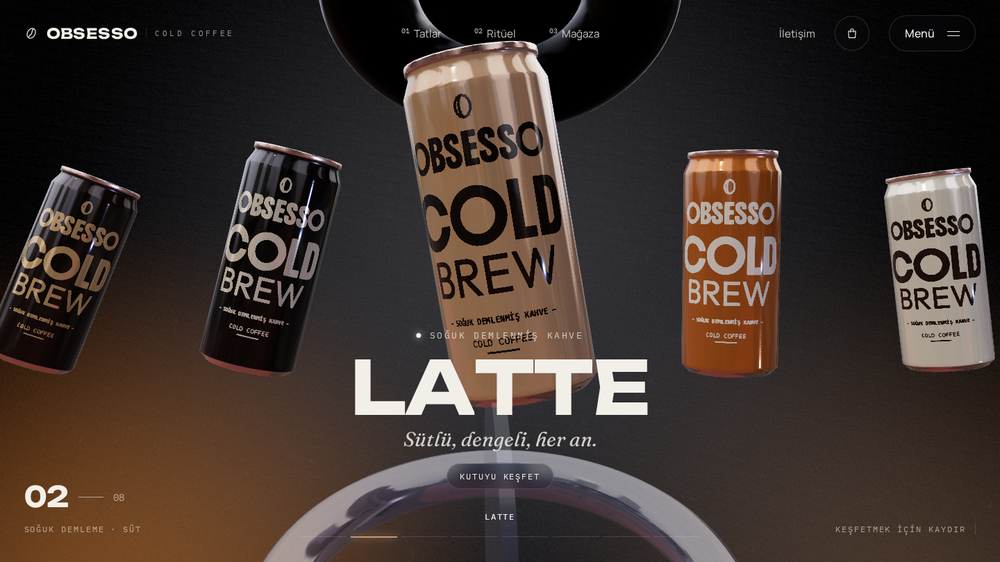
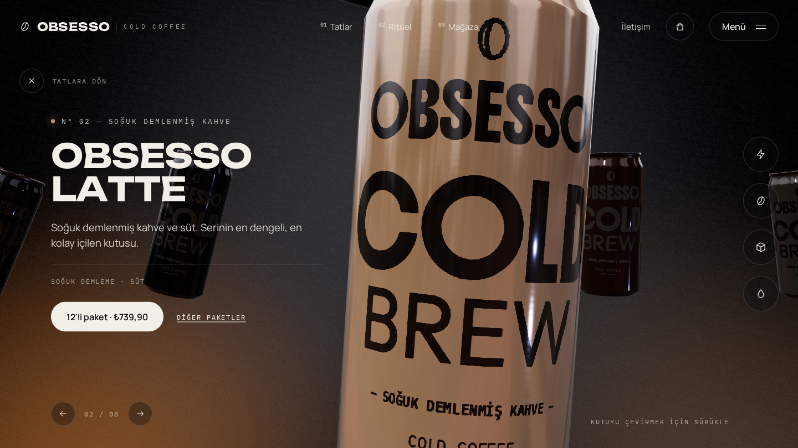
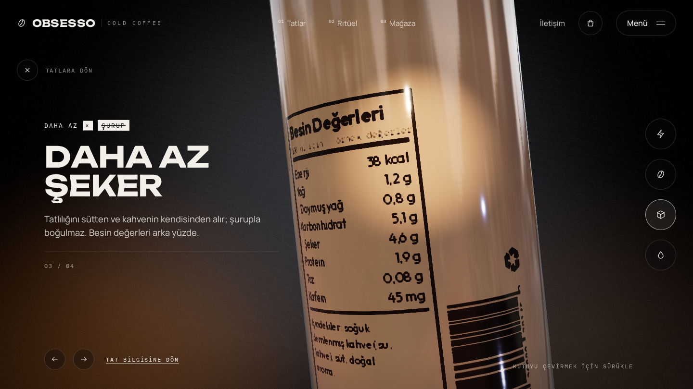

# Obsesso Cold Coffee · 3B konsept demo

> Bu klasör Obsesso'ya sunulmak üzere hazırlanmış **bağımsız bir konsept
> demodur**. Obsesso markasıyla bağlantılı değildir. Kutu etiketi, tat
> isimleri, besin değerleri ve fiyatlar örnektir. Marka sahibinin onayı
> olmadan herkese açık bir adreste yayınlamayın. Sayfa `noindex` etiketlidir.

Blazing Energy projesiyle aynı 3B yapıyı kullanır:

- **Carousel:** Kutular scroll ile döner. Yan kutuya tıklayınca ortadakiyle yer değiştirir, öndeki kutuya tıklayınca detay açılır.
- **Detay:** 4 özellik butonu var (Doğal kafein, Soğuk demleme, Daha az şeker, Gerçek süt). Her birinde kutu dönüp etikete yakınlaşır, spot ışık vurur ve arka plan kararır.
- **Diğer bölümler:** Ritüel (Soğut, Çalkala, Aç), mağaza, sepet ve SSS.





## Çalıştırma

```powershell
cd analiz\obsesso-demo
npm install
npm run dev
```

Tarayıcıda `http://localhost:5173` adresini aç.

## Resmi tasarım gelince değiştirilecekler

| Ne | Nerede |
| --- | --- |
| Kutu etiketi | `src/assets/labels/obsesso-body.png`: 1024×1024, modelin UV yerleşimine göre, **dikey çevrilmiş** (ön yüz x≈325–595, y≈62–412; arka etiket x≈26–154, y≈20–258). `docs/label-generator.py` örnek etiketi üreten betik. |
| Marka adı, alt başlık, uyarı metni | `src/brand.js` |
| Tatlar, özellikler, ritüel, fiyatlar, SSS | `src/data.js` |
| Renkler (arka plan ışıkları) | `src/BackgroundMaterial.js` |

Kutunun rengi her tat için `data.js` içindeki `color` alanından gelir. Etiketteki
beyaz yazılar `ink` rengine boyanır. Gerçek etiket tam renkli bir baskıysa
`src/canMaterial.js` içindeki renk boyama satırı kaldırılıp doku olduğu gibi
kullanılabilir.

## Lisanslar

- Kutu modeli: [Energy Drink Game Ready Model](https://sketchfab.com/3d-models/energy-drink-game-ready-model-83676feb8b0a4589952cf3676299311b), dwalsh, CC BY 4.0 (etiket dokusu değiştirildi)
- Etiket yazı tipleri: Boldonse, Outfit, IBM Plex Mono (SIL OFL)
- Doku geçişi ve arka plan shader'ı: Codrops / Mohammed Amine Bourouis, MIT
