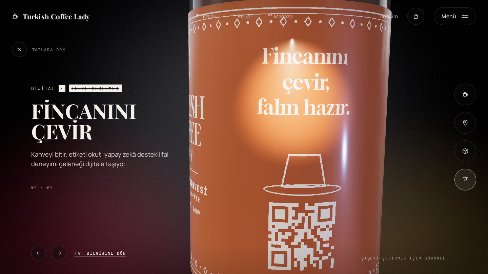

# Turkish Coffee Lady · 3B konsept demo

> Bu klasör Turkish Coffee Lady'ye sunulmak üzere hazırlanmış **bağımsız bir
> konsept demodur**. Marka sahibiyle bağlantılı değildir. Şişe, etiket, ürün
> açıklamaları ve fiyatlar örnektir. Tat isimleri ve notaları basında çıkan
> lansman haberlerine dayanır. Onay alınmadan herkese açık bir adreste
> yayınlanmamalıdır. Sayfa `noindex` etiketlidir.

**Blazing ile aynı 3B yapı, bu kez şişeyle:**

- **Carousel:** Beş şehir tadı var: Bold Istanbul, Silky Mardin, Pistachio Zeugma, Minty Cappadocia ve Piney Aegean. Şişeler scroll ile döner; yan şişeye tıklayınca ortadakiyle yer değiştirir, öndekine tıklayınca detay açılır.
- **Detay:** Dört hikâye var: 500 yıllık tarif, Beş şehir, Sade içerik ve Dijital fal. Her birinde şişe dönüp etiketin farklı bir yüzüne (ön, boyun, besin değerleri, fal paneli) yakınlaşır, spot ışık vurur.
- **Diğer bölümler:** Ritüel (Soğut, Çalkala, Paylaş), mağaza, sepet ve SSS.




## Çalıştırma

```powershell
cd analiz\tcl-demo
npm install
npm run dev
```

Tarayıcıda `http://localhost:5173` adresini aç. Yan şişeye tıklama animasyonunu
ağır çekimde görmek için adresin sonuna `?slowmo=8` ekle.

## Nasıl yapıldı

- **Şişe** (`src/CanMesh.jsx`): Ayrı bir 3B dosya yok; şişe koddan üretilir. Cam gövde ve kahve dönen bir profilden (lathe) çıkar, kapak metaldir, etiket şişeyi saran bir banttır. Şişenin şekli koordinat listesinden değiştirilebilir.
- **Etiket** (`src/assets/labels/tcl-label.png`): `docs/label-generator.py` ile üretilir. Siyah zemin ve beyaz çizimden oluşur; sitede zemin tatın rengine (`color`), yazılar `ink` rengine boyanır. Etiket şişeyi şöyle sarar: u = 0.5 ön yüz (marka), u = 0.25 arka (besin değerleri), u = 0.75 yan (dijital fal).
- **Marka, tatlar, metinler:** `src/brand.js` ve `src/data.js`.

## Resmi tasarım gelince

1. **Şişe:** Gerçek şişenin ölçüleri ya da 3B modeli (GLB) alınır; profil ona göre ayarlanır ya da model doğrudan yüklenir.
2. **Etiket:** Etiketin düz baskı dosyası (PDF/PNG) 2048×836 oranında yerleştirilir. Tam renkli bir etiketse `src/canMaterial.js` içindeki boyama satırı kaldırılır.
3. **Metinler:** Gerçek ürün açıklamaları, fiyatlar ve satış noktaları `src/data.js` dosyasına yazılır. Ödeme bağlantısı `src/config.js` dosyasına eklenir.
