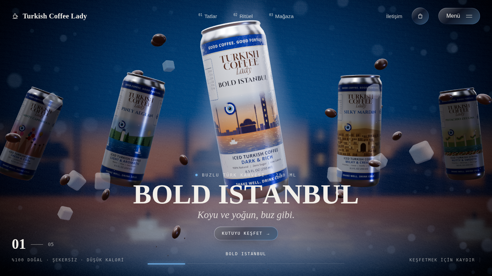
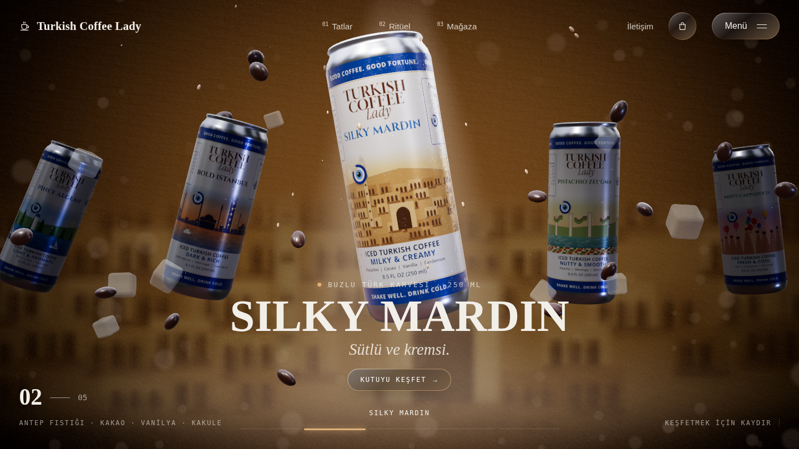
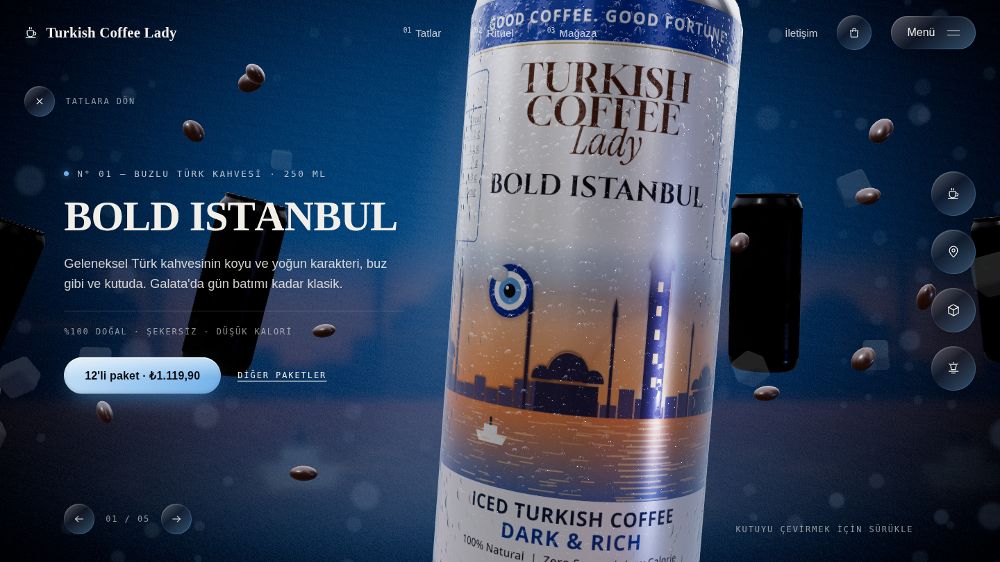
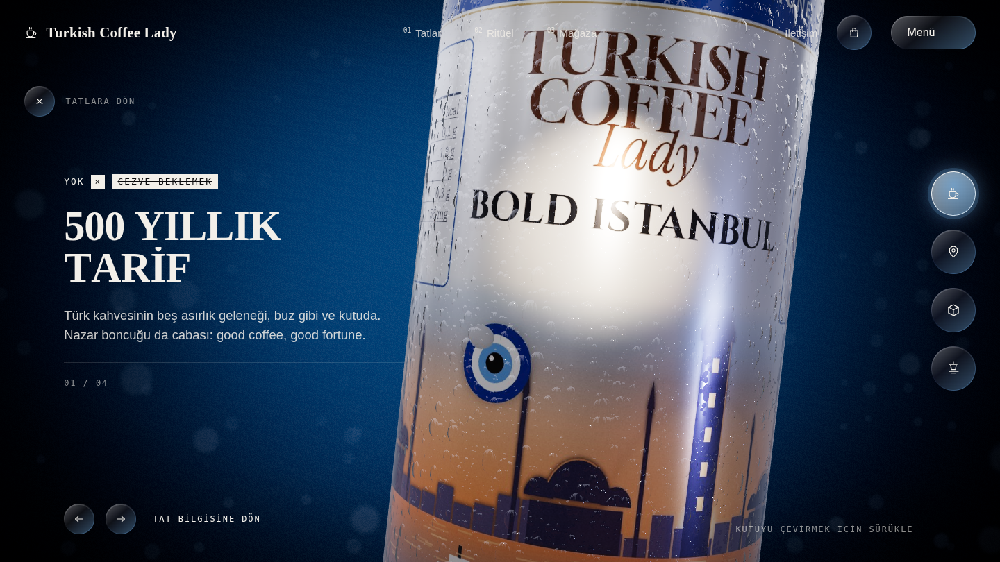
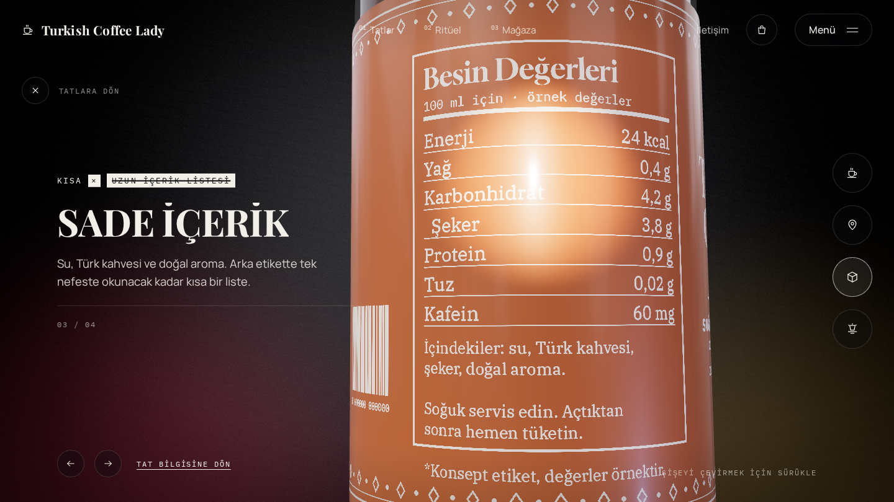

# Turkish Coffee Lady · 3B konsept demo

> Bu klasör Turkish Coffee Lady'ye sunulmak üzere hazırlanmış **bağımsız bir
> konsept demodur**. Marka sahibiyle bağlantılı değildir.
>
> - Kutular, markanın paylaşılan güncel beyaz kutu tasarımından esinlenerek yeniden çizilmiştir (mavi bantlar, TURKISH COFFEE Lady logosu, nazar boncuğu, gün batımında şehir resmi).
> - Diğer üç tadın kutuları aynı tasarım dilinde konsept önerileridir.
> - Besin değerleri, açıklamalar ve fiyatlar örnektir.
>
> Onay alınmadan herkese açık bir adreste yayınlanmamalıdır. Sayfa `noindex` etiketlidir.

**Blazing ile aynı 3B yapı, 250 ml slim kutularla:**

- **Her tadın kendi sahnesi:** Bold Istanbul buz mavisi, Silky Mardin karamel, Zeugma fıstık yeşili, Kapadokya mint, Ege derin mavi. Tat değişince arka plan, ışık, parçacıklar ve butonların rengi o tada geçer; kutudan tadın renginde kahve sıçrar (koyu ya da sütlü).
- **Vitrin ışığı:** Öndeki kutuya tepeden tadın renginde spot ışık düşer, yandaki kutular kademeli olarak kararır. Kutuların kenarlarında tadın renginde ince bir parıltı, yüzeylerinde yoğuşma damlacıkları var.
- **Sinematik arka plan:** Her tadın kendi şehir resmi arkada bulanık bir alacakaranlık manzarası olarak görünür (İstanbul, Mardin…). Üstünde tepeden inen ışık huzmesi, kutunun altında ışık havuzu, süzülen bokeh ışıkları ve kenar karartması var.
- **Reklam sahnesi:** Kutuların arasında buz küpleri ve kahve çekirdekleri süzülür.
- **Premium butonlar:** Cam efekti, tadın renginde ışıltılı kenar, üzerine gelince parlama ve fareye doğru hafif mıknatıs hareketi.
- **Carousel:** Beş şehir tadı var: Bold Istanbul, Silky Mardin, Pistachio Zeugma, Minty Cappadocia ve Piney Aegean. Kutular scroll ile döner; yan kutuya tıklayınca ortadakiyle yer değiştirir, öndekine tıklayınca detay açılır.
- **Detay:** Dört hikâye var: 500 yıllık tarif (fincan yakın çekimi), Beş şehir (siluet), Sade içerik (besin değerleri) ve Dijital fal. Her birinde kutu dönüp yakınlaşır, spot ışık vurur.
- **Diğer bölümler:** Ritüel (Soğut, Çalkala, Paylaş), mağaza, sepet ve SSS.







## Çalıştırma

```powershell
cd analiz\tcl-demo
npm install
npm run dev
```

Tarayıcıda `http://localhost:5173` adresini aç. Yan kutuya tıklama animasyonunu
ağır çekimde görmek için adresin sonuna `?slowmo=8` ekle.

## Nasıl yapıldı

- **Kutu** (`src/CanMesh.jsx`): Ayrı bir 3B dosya yok; kutu koddan üretilir. Alüminyum gövde ve kapak dönen bir profilden (lathe) çıkar, açma halkası eklenir, baskı gövdeyi saran bir banttır. Ölçüler slim kutu oranındadır.
- **Etiketler** (`src/assets/labels/*.jpg`): `docs/label-generator.py` ile tam renkli olarak üretilir (fontlar `docs/label-fonts` altında, SIL OFL). Etiket kutuyu şöyle sarar: u = 0.5 ön yüz, u = 0.25 arka (besin değerleri), u = 0.75 yan (dijital fal). Düz hallerini görmek için: `docs/labels-flat.png`.
- **Tat geçişi** (`src/canMaterial.js`): Tat değişirken iki etiket görseli arasında Codrops projesindeki gürültülü geçiş oynar.
- **Sahne:** `src/IceScene.jsx` (buz küpleri, çekirdekler, sıçrama), yoğuşma normal haritası `docs/droplets-generator.py`, `src/BackgroundMaterial.js` (tadın ışığı). Her tadın renkleri `src/data.js` içinde `theme` alanındadır.
- **Marka, tatlar, metinler:** `src/brand.js` ve `src/data.js`.

## Resmi tasarım gelince

1. **Etiketler:** Markanın gerçek kutu baskı dosyaları (düz, açılmış etiket; PDF ya da PNG) 2048×1418 oranında `src/assets/labels` altına konur; kod değişmez.
2. **Metinler:** Gerçek ürün açıklamaları, fiyatlar ve satış noktaları `src/data.js` dosyasına yazılır. Ödeme bağlantısı `src/config.js` dosyasına eklenir.
